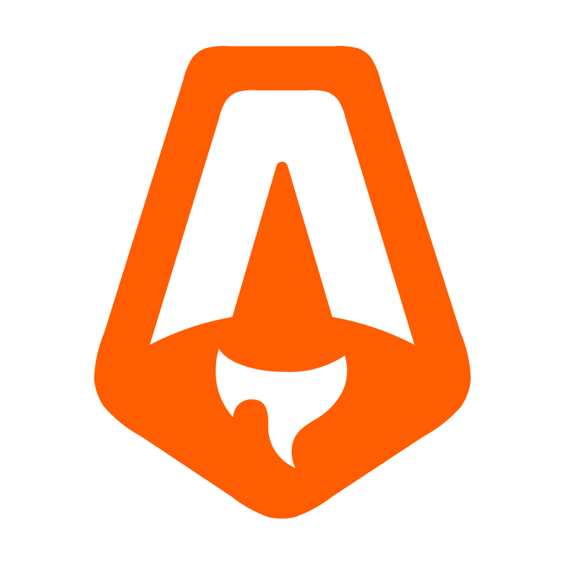

  

  # Hi, I’m Lucas Lopes!

  **About me...**

  Welcome to my GitHub profile! I am an aspiring software developer currently studying Computer Science at DIMAp - UFRN.

  Passionate about technology and always willing to learn. I enjoy breaking down and creating the logic behind algorithms and systems, as well as expressing my creativity; computing is the medium through which I found my    calling.

  ## Languages ​​and Technologies

  

    
    
    
    
    
    
    
    
    
    
    
  

  ## Global Statistics

  
  
  

   

  

   
  
  ---
  
  
   
  <i>"Even if the world falls apart, we can start over as many times as it takes."</i>

   

  ---

   
 > Always open to collaborate, learn, and grow! < 

